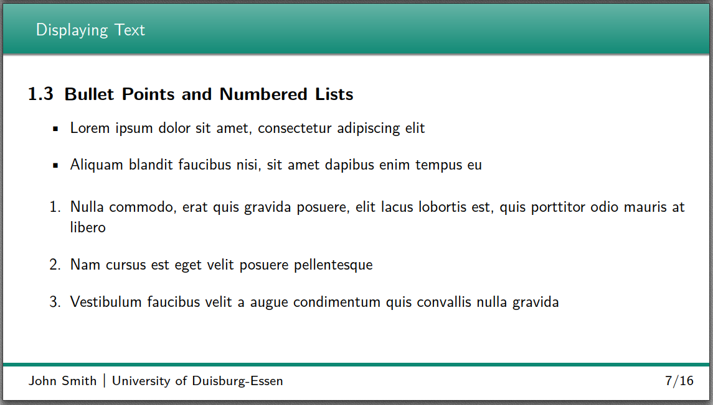

# LaTeX Presentation Template

This Project aims to provide a clean and good-looking presentation template in a 16:9 widescreen format.

It is based on the [KOMA-Script Presentation](http://www.latextemplates.com/template/koma-script-presentation) from latextemplates.org, that was designed by Marius Hofert and Markus Kohm.



Table of contents:
- [LaTeX Presentation Template](#latex-presentation-template)
  - [Usage](#usage)
    - [Variables](#variables)
      - [Text](#text)
      - [Config](#config)
      - [Colors](#colors)
    - [Structure](#structure)
      - [Base](#base)
      - [Sections](#sections)
  - [Features](#features)
    - [Listings](#listings)
  - [TODO](#todo)
  - [License](#license)

## Usage

### Variables

#### Text

Text variables that are used to define common strings used throughout the presentation.

| Name          | Meaning                     | Used in                      |
| ------------- | --------------------------- | ---------------------------- |
| `mytitle`     | Presentation title          | Title slide                  |
| `runninghead` | Header text                 | Slide footer                 |
| `myauthor`    | Author(s)/Presenter(s) name | Title slide and slide footer |
| `mydate`      | Date of presentation        | Title slide                  |
| `myuni`       | University or institution   | Title slide and slide footer |
| `myfac`       | Faculty                     | Title slide                  |
| `mysubj`      | Subject                     | N/A                          |
| `mysup`       | Supervisor                  | N/A                          |


#### Config

| Name          | Meaning                      | Used in  |
| ------------- | ---------------------------- | -------- |
| `preslang`    | Language of the presentation | babel    |
| `secnumdepth` | Depth of Table of contents   | main.tex |
| `tocdepth`    | Depth of section numbering   | main.tex |


#### Colors

Can be used to color text with `\cprimary{text to color in primary}` or with `\color{<name>}` to set a color anywhere in the document.

| Name         | Meaning         | Used in                     |
| ------------ | --------------- | --------------------------- |
| `cprimary`   | Primary Color   | Header, Footer, Title slide |
| `csecondary` | Secondary Color | N/A                         |
| `chighlight` | Highlight Color | N/A                         |


### Structure

1. Title Slide
2. Table of Contents
3. Presentation Slides
   1. Section 1
   2. Section 2
   3. ...
4. Final Slide
5. References

#### Base
The title and final slide are located in the `Base` folder.

#### Sections
All sections can be placed into the `Sections/`-folder and included with `\input{Sections/sectionX.tex}` at the end of the `main.tex`.  
The file `Sections/SectionX` is an empty template, to use it replace `X` with the correct number. Also update the label (`\label{sectionX}`) and the running head ref (`\renewcommand*{\runninghead}{\nameref{sectionX}}`).

## Features

### Listings

To document source code, the `listings`-package can be used. The full documentation can be found [here](http://mirror.utexas.edu/ctan/macros/latex/contrib/listings/listings.pdf).

Sample listing:

```tex
\begin{lstlisting}[
    caption={Sample PHP Listing},
    label={lst:sample},
    language=PHP,
    float=!h
]
public function renderView($view, $args = [])
{
    $template = $this->templatePath . "/views/" . $view . '.twig';
    if (!file_exists($template)) {
        $this->return->failReason = 'Could not find template.';
        $this->send();
        die();
    }
    $html = $this->render($template, $args);
    return $html;
}
\end{lstlisting}
```


## TODO

- [ ] Get rid of package `tocstyle` due to various warnings and incompatibilities
- [ ] Include `titletoc` for partial ToCs at section start
  - [ ] -> replacing `tocstyle` features
  - [ ] Add sample of partial ToC of subsections only at section start
- [ ] Check if needed features of `titlesec` can be replaced by KOMA standard features
- [ ] Package `scrpage2` is obsolete; replace with `scrlayer-scrpage`
- [ ] Fix margins to fit new paper size
- [ ] Fix listing centering (only caption gets centered)
- [ ] Improve title and final slide
- [ ] Include package list and links to documentation into README
- [ ] Add examples
  - [ ] Text + small figure with minipages
  - [ ] Two figures on a slide
  - [ ] Add custom itemize symbols
- [ ] Test `\hypersetup{pdfpagemode=FullScreen}` for automatic full screen

## License

This template is licensed under the [Creative Commons CC BY-NC-SA 4.0](https://creativecommons.org/licenses/by-nc-sa/4.0/) license (see also the [LICENSE file](LICENSE.md))